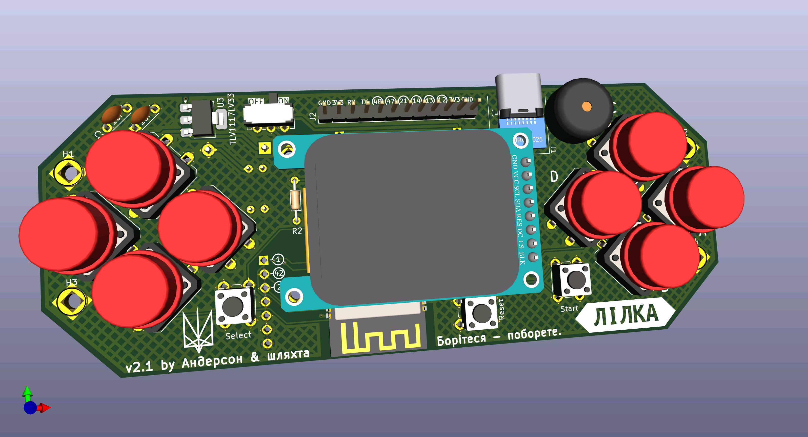

# Lilka

🇺🇸[English](README.md) |
🇺🇦[Українська](README.ua.md)

[][discord]

DIY console you can build from ready-to-use modules.

## Where can I buy Lilka?

All links and instructions are available [here](https://lilka.dev/shop/) (currently only in Ukraine).

## Demo

News about the Lilka V2 project:

First version of Lilka:

## Documentation

Full project documentation is available here: <https://docs.lilka.dev>

## Community

Join [our Discord server][discord]!

## I want to help write code!

We'd be happy to have your help! There are several ways to contribute:

- Want to write a game, an app, documentation, or something else? Great! The documentation is available [here (C++)](https://docs.lilka.dev/uk/latest/keira/custom_apps/) and [here (Lua)](https://docs.lilka.dev/uk/latest/keira/lua/intro/).
- Want to help improve the code? Run the `make todo` command to list TODOs in the codebase where help is needed.
- Want to help with ideas? Found a bug or have an idea to improve the architecture? Create a new issue or message us on our [Discord][discord] forum `#lilka`.

[discord]: https://discord.gg/HU68TaKCu6
