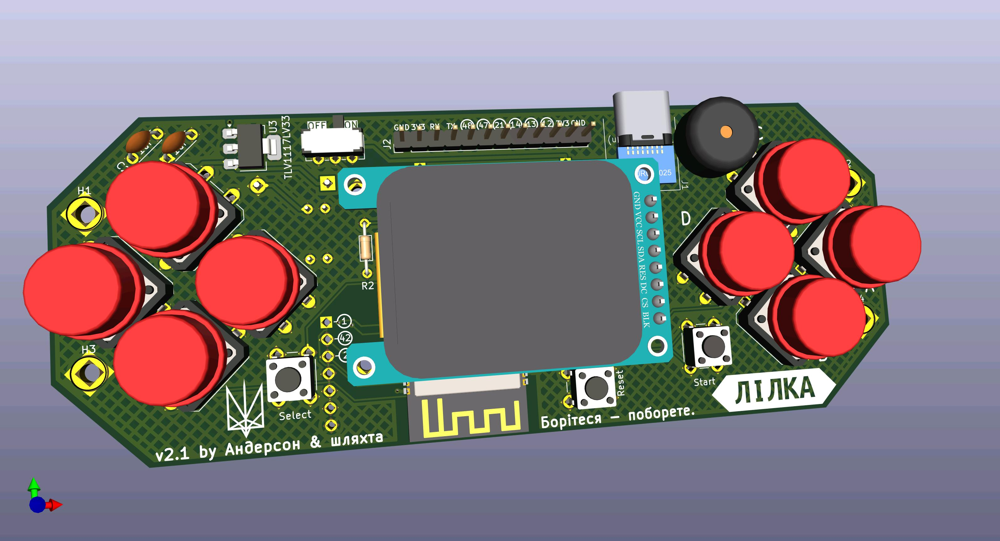

# Lilka

🇺🇸[English](README.md) |
🇺🇦[Українська](README.ua.md)

[][discord]

DIY-console, what you can create from ready to use modules.

## Where i can buy Lilka?

All links and instructions are available(now aviable only in Ukraine) [here](https://lilka.dev/shop/)!

## Demo

News about the Lilka V2 project:

First version of Lilka:

## Documentation

Full project documentation is available here: <https://docs.lilka.dev>

## Community

Join [our Discord server][discord]!

## I want to help write code!

We will be only too happy! There are several options:

- Do you want to write a game, program, documentation, or something else? Sure! The documentation is available [here (C++)](https://docs.lilka.dev/uk/latest/keira/custom_apps/) and [here (Lua)](https://docs.lilka.dev/uk/latest/keira/lua/intro/).
- Want to help improve the code? Run the `make todo' command and it will display all the TODOs from the code where help is needed.
- Want to help with ideas? Found a bug or have an idea for improving the architecture? Create a new ticket or write to our [Discord][discord] forum `#lilka`.

[discord]: https://discord.gg/HU68TaKCu6
